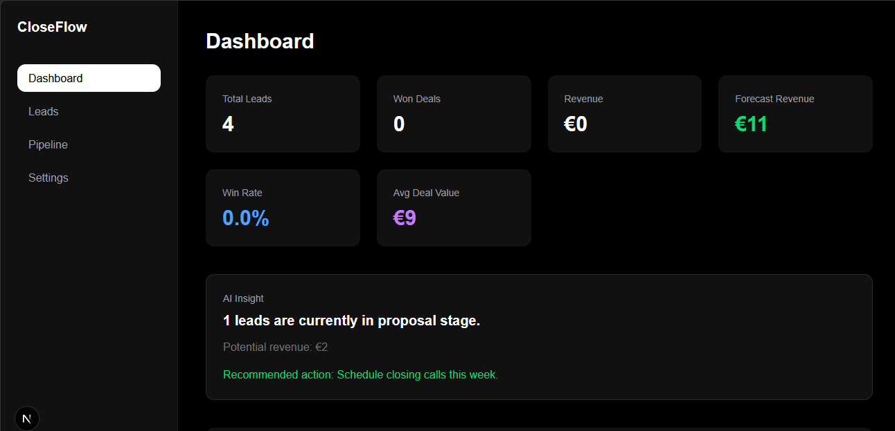
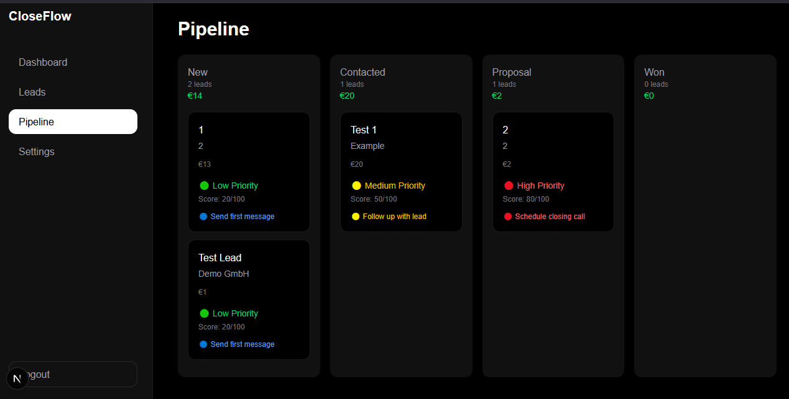
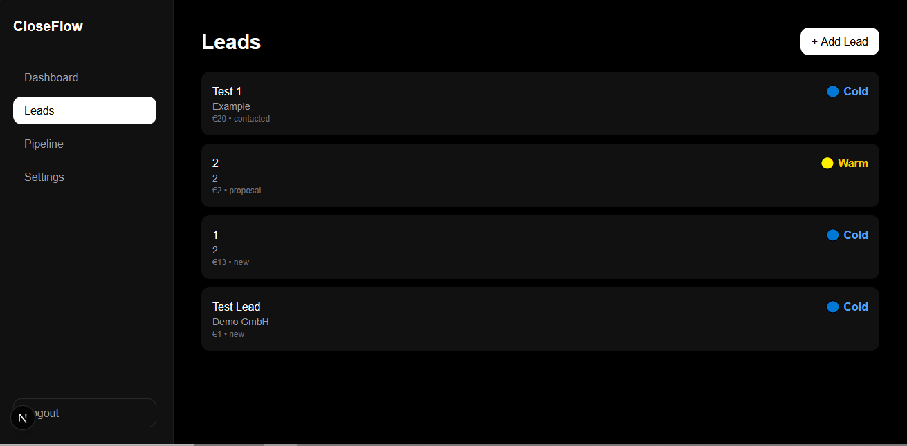

# CloseFlow

CloseFlow is a modern AI-inspired CRM and decision intelligence platform built with **Next.js, Supabase, TypeScript, and Tailwind CSS**.

CloseFlow goes beyond traditional CRMs by combining lead management, analytics, and AI-inspired recommendations to help users prioritize opportunities and decide what to do next.

---

## Features

### AI Recommendation Engine

* AI-inspired recommendation engine
* Dynamic Priority Score (0–100)
* Low / Medium / High priority classification
* Context-aware lead suggestions
* Transparent recommendation reasoning
* Decision support for every lead

### Lead Management

* Create, edit and delete leads
* Company and deal management
* Notes system
* Pipeline workflow
* Deal value tracking

### Smarter Dashboard

* Priority Deals system
* Win rate metrics
* Average deal value
* Revenue overview
* Improved KPI dashboard

### Analytics

* Revenue trend visualization
* Pipeline distribution charts
* Lead status breakdown
* Interactive dashboard analytics

### Notifications Engine

* Automated deal alerts
* Pipeline risk detection
* High-value opportunity highlights

### Activity Timeline

* Automatic activity tracking
* Status change history
* Event type icons
* Structured lead history
* Improved readability and UX

### Lead Intelligence

* Deal age tracking
* Pipeline staleness detection
* Intelligent opportunity prioritization

---

## Product Vision

CloseFlow is evolving from a CRM into a **decision intelligence platform**.

The goal is not just to manage leads—but to help users decide what to do next.

Instead of simply displaying customer information, CloseFlow continuously analyzes pipeline data to highlight priorities, opportunities, and recommended actions.

---

## Tech Stack

* Next.js 14
* React
* TypeScript
* Supabase
* PostgreSQL
* Tailwind CSS
* Recharts

---

## Screenshots

### Dashboard



### Pipeline



### Leads



### Lead Detail

.png)

%20\(2\).png)

### Dashboard Analytics

.png)

.png)

---

## Roadmap

Execution roadmap and implementation status are tracked in:

* ROADMAP.md

Highlights:

* `Now`: Core CRM + AI Assistant + Teams (DB-first) are implemented
* `Next`: Auth completion, notifications center, global search, command palette, calendar
* `Later`: reporting suite, enterprise permissions, full billing/integration backend

---

## Project Goal

CloseFlow is a portfolio SaaS project focused on building a modern CRM while exploring real-world full-stack development and AI-assisted workflows.

The project covers:

* CRM architecture
* Sales analytics
* Decision intelligence
* SaaS product development
* AI-powered business tools

CloseFlow is actively developed in public and continuously improved step by step.

---

## Status

Actively built in public with new features and improvements released regularly.

---

## Team Workspace Migration

CloseFlow now includes a database-first team architecture using these tables:

* organizations
* organization_members
* organization_invites

Migration file:

* supabase/migrations/20260713_team_workspace.sql
* supabase/backfill-team-metadata.sql (optional, for legacy metadata migration)

What this migration adds:

* Team workspace schema with role and status checks
* Row Level Security policies for member-based access
* Invite acceptance RPC: accept_organization_invite
* Invite creation RPC: create_organization_invite
* Case-insensitive email uniqueness safeguards
* Organization audit events for invite lifecycle (created, refreshed, accepted)

Apply the migration with your normal Supabase workflow, for example:

```bash
supabase db push
```

If you previously stored team data in auth user metadata (`team_workspace`), run the backfill script in Supabase SQL Editor to migrate those records into relational team tables.

