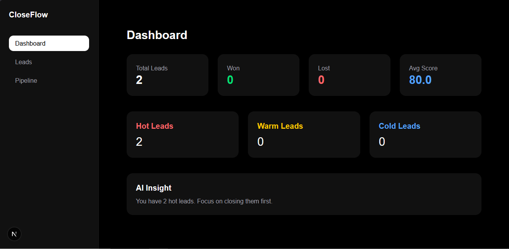
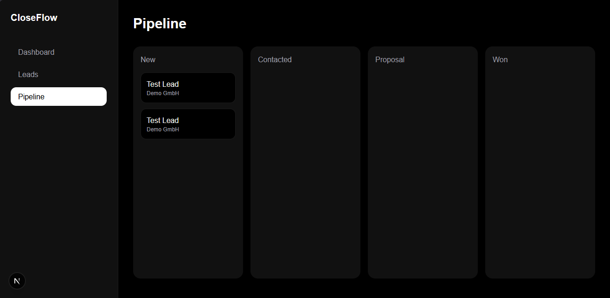
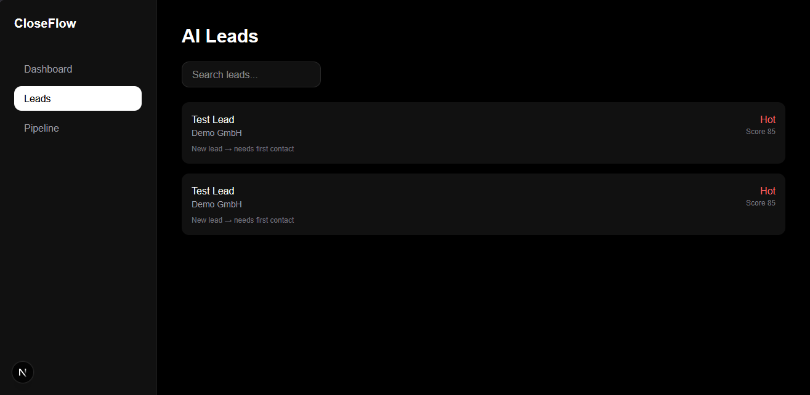

# CloseFlow

CloseFlow is a modern AI-inspired CRM and decision intelligence platform built with Next.js, Supabase, TypeScript, and Tailwind CSS.

It goes beyond traditional CRMs by not only storing lead data, but helping users understand where to focus next.

---

## What’s new

### smarter Dashboard
- Priority Deals system for better focus
- Win rate and average deal value metrics
- Improved KPI overview

### Notifications Engine
- Automated deal alerts
- Pipeline risk detection
- High-value opportunity highlights

### Analytics Upgrade
- Revenue trend visualization
- Pipeline distribution charts
- Lead status breakdown

### Decision Intelligence Layer
- Context-aware recommendations based on pipeline state
- Next best action system per lead
- Transparent reasoning behind suggestions

### Lead Intelligence

- Structured next best action system
- Priority-based recommendations (low / medium / high)
- Context-aware lead suggestions
- Action reasoning for transparency
- Improved decision support per lead

### Activity Timeline (Improved)

- Event type icons for better clarity
- Status change tracking
- Structured activity history per lead
- Improved readability and UX

---

## Product Vision

CloseFlow is evolving from a CRM into a **decision intelligence tool**.

The goal is not just to manage leads —  
but to help sales teams decide what to focus on next in real time.

---

## Tech Stack

- Next.js 14
- TypeScript
- Supabase
- Tailwind CSS
- Recharts

---

## Screenshots

### Dashboard

### Pipeline

### Leads

### Lead Detail
.png)
%20(2).png)

### Dashboard Analytics
.png)
.png)

---

## Next Steps

- AI-powered lead intelligence
- Smart deal alerts
- Real-time revenue tracking from database
- OpenAI integration
- Team collaboration features

---

## Status

Actively built in public

